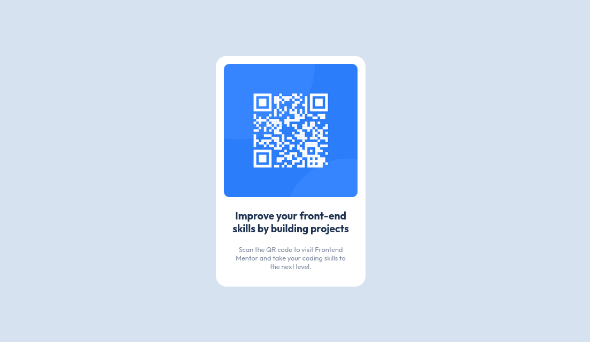

# Frontend Mentor - QR code component solution

This is a solution to the [QR code component challenge on Frontend Mentor](https://www.frontendmentor.io/challenges/qr-code-component-iux_sIO_H). Frontend Mentor challenges help you improve your coding skills by building realistic projects.

## Table of contents

- [Overview](#overview)
    - [Screenshot](#screenshot)
    - [Links](#links)
- [My process](#my-process)
    - [Built with](#built-with)
    - [What I learned](#what-i-learned)
    - [Continued development](#continued-development)
    - [Useful resources](#useful-resources)
- [Author](#author)
- [Acknowledgments](#acknowledgments)

## Overview
- QR Code Challenge on Frontend Mentor.
### Screenshot

### Links

- Solution URL: [https://github.com/samuelorobosa/qr-code-component-main](https://github.com/samuelorobosa/qr-code-component-main)
- Live Site URL: [https://qr-code-component-main-gules.vercel.app/](https://qr-code-component-main-gules.vercel.app/)

### Built with

- Semantic HTML5 markup
- CSS custom properties

## Author

- Website - [Samuel Amagbakhen](https://samuelorobosa.xyz/)
- Frontend Mentor - [@samuelorobosa](https://www.frontendmentor.io/profile/samuelorobosa)
- Twitter - [@samuel_orobosa](https://www.twitter.com/samuel_orobosa)
